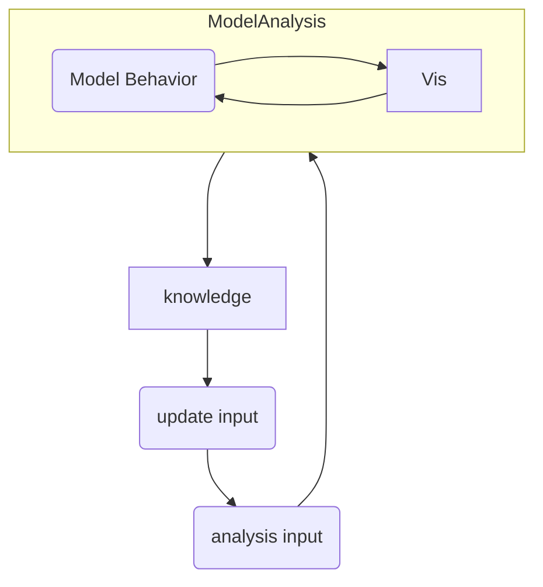

# XAI研究型UI

## TODO

1. 可以slice 3D volume
2. 把資料管理合併為一個，並且也只有一個3D顯示與3個2D顯示
3. 選擇要觀看哪個class結果與可解釋AI

## 目的

## 目前架構

## 擁有功能

## 待完成功能

## When & How/Why & What

### T&P定義

When : 與資料集相關

How/Why : 與模型架構、參數，訓練參數、資料前後處理相關

What : 模型輸出、模型表現相關

### in Autonomous Driving

When : 何時發生，與時間資訊相關。汽車當下的狀態，如:加速度、速度、轉向幅度

Where : 在哪裡發生，與空間資訊相關。汽車當下的路況，如:GPS位置、周圍汽車位置

How : 模型的表現如何，與模型相關。

### in Heart CT 

#### 架構T&P 

## 可以有的VA面板

### Input

1. t-sne降維
2. 自動產生反例
3. 強化transform檢測最差能預測正確的例子(如:旋轉不同角度、perspective變換、毀滅性放大縮小)

### Output

1. 可解釋AI(Grad-base)，整個模型不同層級皆應有解釋
2. 模型表現指標(IOU、confusion metrix)
3. volume rendering協助呈現3D資訊
4. 自動定位表現較差的切片(x,y,z三種切片)
5. 架構修改指引( AutoML / Neural Architecture Search(NAS) )

### 互動方式

1. 主動式學習 (可即時調整標註資料)
2. 篩選輸入資料
3. 調整切片(x,y,z)位置
4. 切換模型

### transfer function

問題 : 
Grad-CAM的熱力圖是一個本來就有關注度的數值的3D資料，但需要與真實資料疊再一起顯示才可以知道實際上關注的位置有沒有分離，但transfer function需要可以辨別原本的內容與熱力圖內容。

解決辦法 : 
1. 使用兩個transfer function最後合併，為了讓使用者簡單使用，可以固定熱力圖的顏色和原始資料的強度，這樣對使用者來說一樣是只要設定一組顏色與強度，但是顏色是改變原始資料，強度改變熱力圖透明度。
2. 針對熱力圖使用ROI Mask，對高強度地方有高亮度和細節

## 可參考內容

### UI 介面

napari : 專為 N-dimensional 醫學與生醫資料打造的 Python 視覺化平台

### 3D Slicer

目前很多使用者的UI組件庫